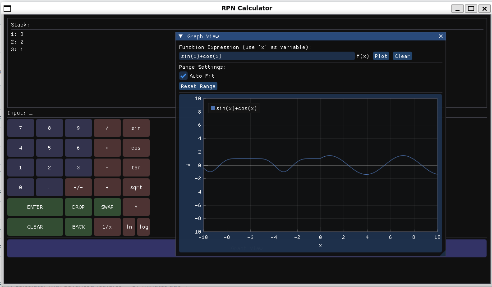

# CppRpnCalc

A modern RPN (Reverse Polish Notation) calculator built with C++ and ImGui, featuring a graphical interface, user-defined functions, and comprehensive mathematical operations.

## Demo



## Features

### Core Functionality
- **RPN Stack Operations**: Traditional RPN calculator with visual stack display
- **User-Defined Functions**: Define custom functions using `{ }` syntax
- **Comprehensive Math Operations**: Full suite of mathematical, trigonometric, and logarithmic functions
- **Modern GUI**: Built with ImGui for a clean, responsive interface

### Operations

#### Basic Arithmetic
- `+` - Addition (also concatenates strings when implemented)
- `-` - Subtraction
- `*` - Multiplication
- `/` - Division
- `^` - Power
- `mod` - Modulo

#### Stack Manipulation
- `dup` - Duplicate top value
- `drop` - Remove top value
- `swap` - Swap top two values
- `clear` - Clear entire stack
- `rot` - Rotate top 3 values (a b c → b c a)
- `over` - Copy second value to top (a b → a b a)
- `pick` - Copy nth element to top (n is popped from stack)
- `roll` - Rotate n elements on stack

#### Comparison Operations
- `>` - Greater than (returns 1.0 or 0.0)
- `<` - Less than
- `>=` - Greater than or equal
- `<=` - Less than or equal
- `==` - Equal
- `!=` - Not equal

#### Mathematical Functions
- `sqrt` - Square root
- `abs` - Absolute value
- `+/-` - Negate
- `1/x` - Reciprocal
- `round` - Round to nearest integer
- `floor` - Round down
- `ceil` - Round up
- `min` - Minimum of two values
- `max` - Maximum of two values

#### Trigonometric Functions
- `sin` - Sine
- `cos` - Cosine
- `tan` - Tangent

#### Logarithmic Functions
- `ln` - Natural logarithm
- `log` - Base 10 logarithm
- `exp` - Exponential (e^x)

### User-Defined Functions

Define custom functions using the syntax:
```
functionName { operation1 operation2 ... }
```

Examples:
```
square { dup * }
cube { dup dup * * }
average { + 2 / }
isPositive { 0 > }
max3 { max max }
```

Functions can:
- Call other functions (including recursively)
- Use any built-in operations
- Be redefined (except built-in operations)

## Building

### Requirements
- CMake 3.10+
- C++17 compiler
- OpenGL
- GLFW3
- GoogleTest (fetched automatically for tests)

### Build Instructions

```bash
# Clone the repository
git clone https://github.com/cschladetsch/CppRpnCalc.git
cd CppRpnCalc

# Create build directory
mkdir -p build && cd build

# Configure and build
cmake .. && make

# Run the calculator
./rpn_calculator

# Run tests
./rpn_calculator_tests
```

### Build Scripts
- `build.sh` - Quick build script
- `test.sh` - Run tests

## Architecture

The calculator follows the Model-View-Controller (MVC) pattern:

- **Model** (`CalculatorModel`): Manages the RPN stack, operations, and function definitions
- **View** (`CalculatorView`): Handles the ImGui interface rendering
- **Controller** (`CalculatorController`): Coordinates between model and view, handles user input

## Testing

Comprehensive test suite with 29+ test cases covering:
- Basic arithmetic operations
- Stack manipulation
- Function definitions and execution
- Error handling
- Edge cases

Run tests with:
```bash
cd build
./rpn_calculator_tests
```

## Usage

1. **Enter numbers**: Type numbers and press Enter to push to stack
2. **Operations**: Type operation names or click buttons
3. **Define functions**: Type `functionName { operations }` and press Enter
4. **Call functions**: Type the function name and press Enter

### Example Session
```
5 [Enter]          // Push 5
3 [Enter]          // Push 3
+                  // Result: 8
2 [Enter]          // Push 2
*                  // Result: 16
sqrt               // Result: 4

// Define a function
square { dup * }
3 [Enter]
square             // Result: 9
```

## License

This project is open source. Feel free to use and modify as needed.

## Contributing

Contributions are welcome! Please feel free to submit pull requests or open issues for bugs and feature requests.
